# BEERs

## 1. Introduction
BEERs is a simple web application developed using ReactJS and Next.js. It provides users with information about different brands of beers, specifically Ales and Stouts, totaling 297 different brands. Users can explore basic details such as name, price, rating, etc., for each beer. The data for this application is sourced from an external API available at: https://sampleapis.com/api-list/beers

## 2. Features

<ul>
    <li>View information about 297 different brands of beers, categorized into Ales and Stouts.</li>
    <li>Explore details such as name, price, rating, etc., for each beer.</li>
    <li>Ratings are represented using star ratings.</li>
    <li>The application is responsive and adapts to different screen sizes.</li>
    <li>Pagination functionality allows users to navigate through multiple pages of beer listings.</li>
    <li>The application supports the system's light and dark modes, allowing it to automatically adjust its color theme based on the user's system settings. </li>
</ul>

## 3. Technologies Used

<ul>
   <li>Next.js: A React framework for building server-side rendered and statically generated web applications.</li>
   <li>ReactJS: A JavaScript library for building user interfaces.</li>
   <li>Tailwind CSS: A utility-first CSS framework for quickly building custom designs.</li>
</ul>

## 4. Layouts
### Layout Variation for Different Pages in Different Color Modes and Screen Sizes

   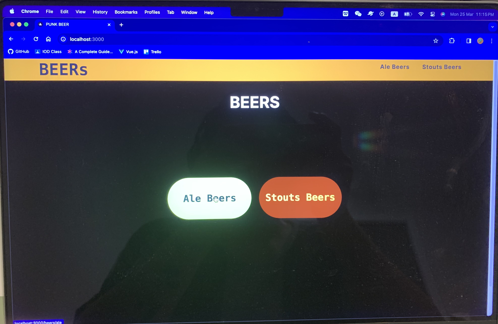

   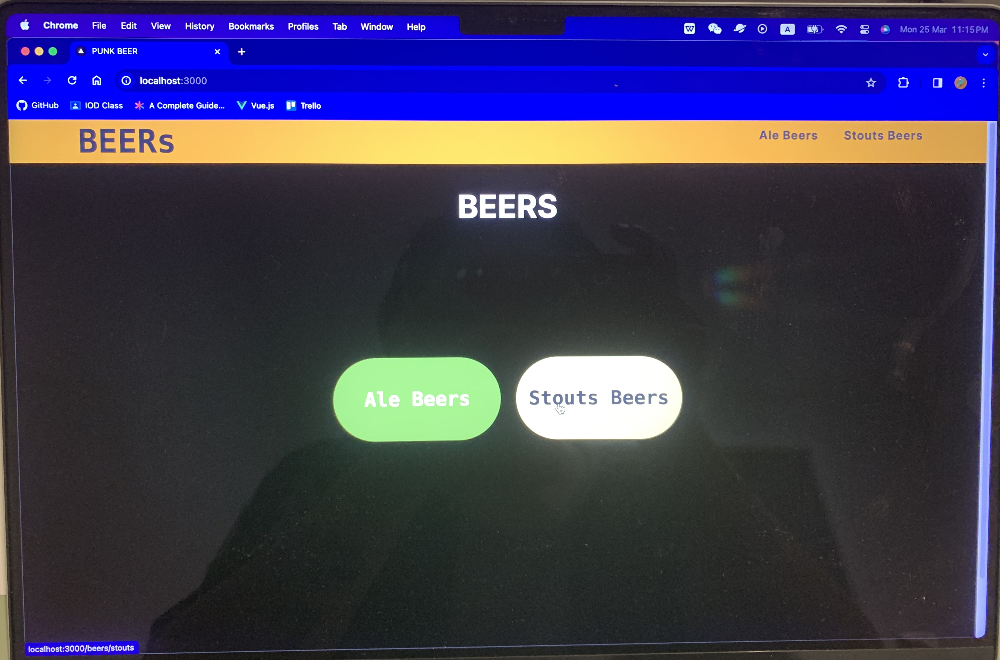

   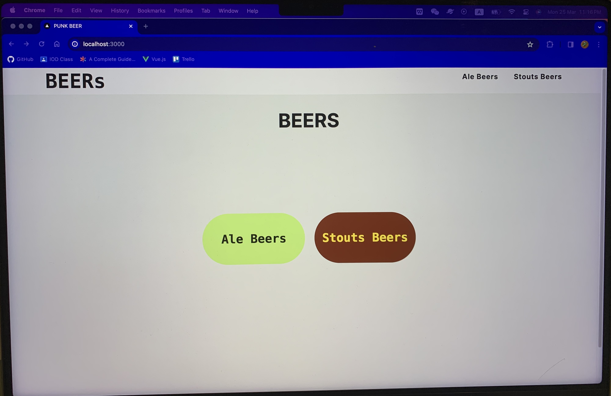

   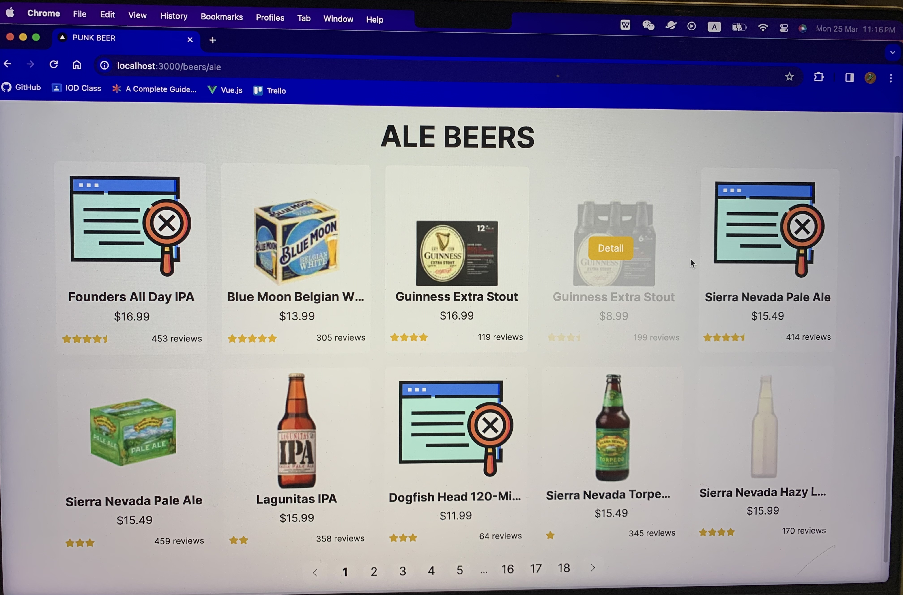

   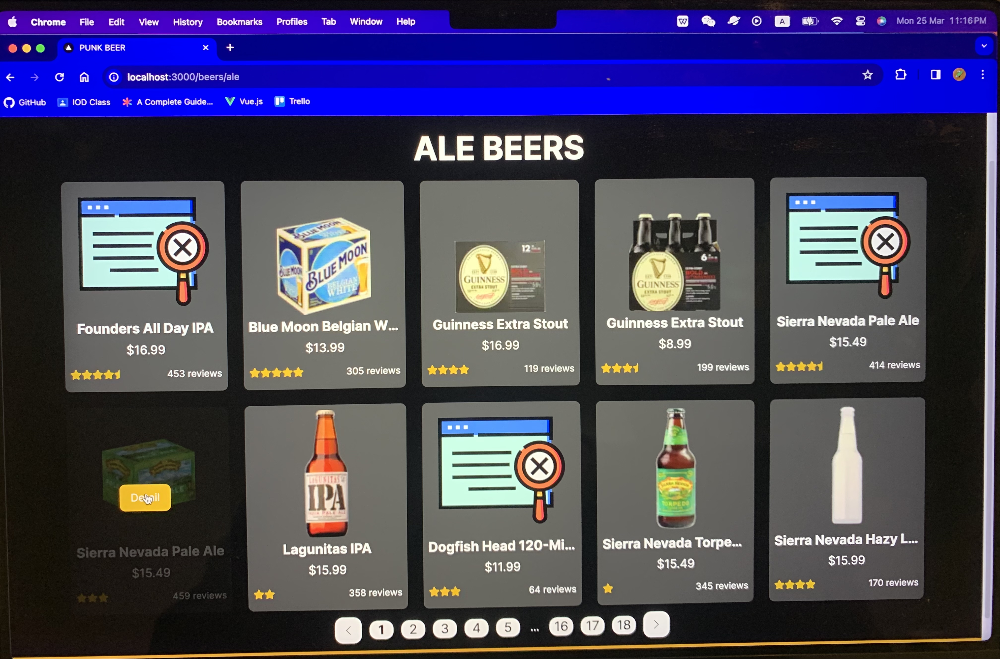

   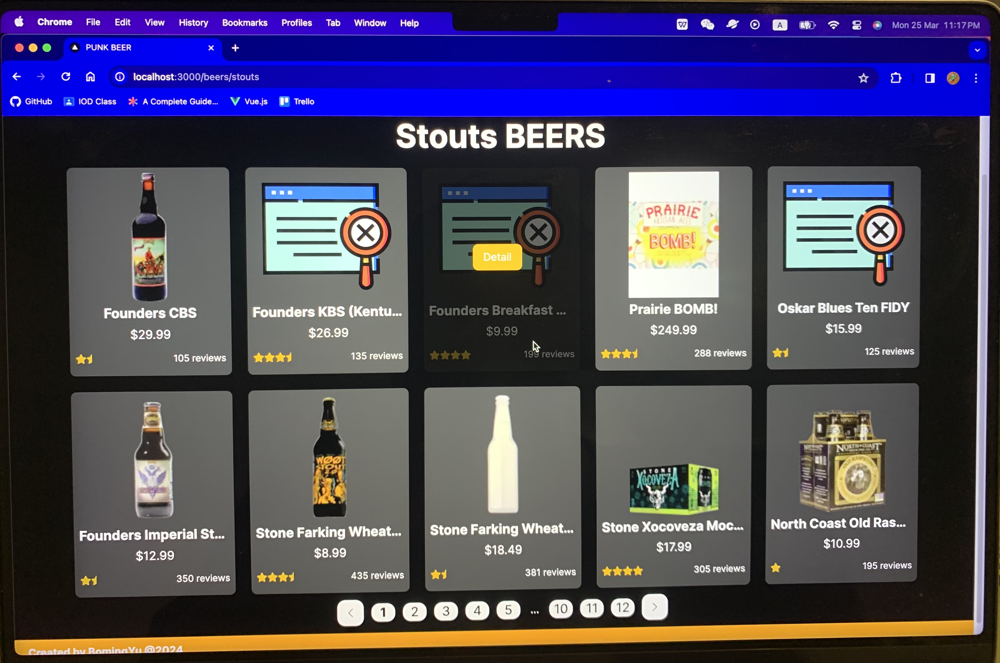

   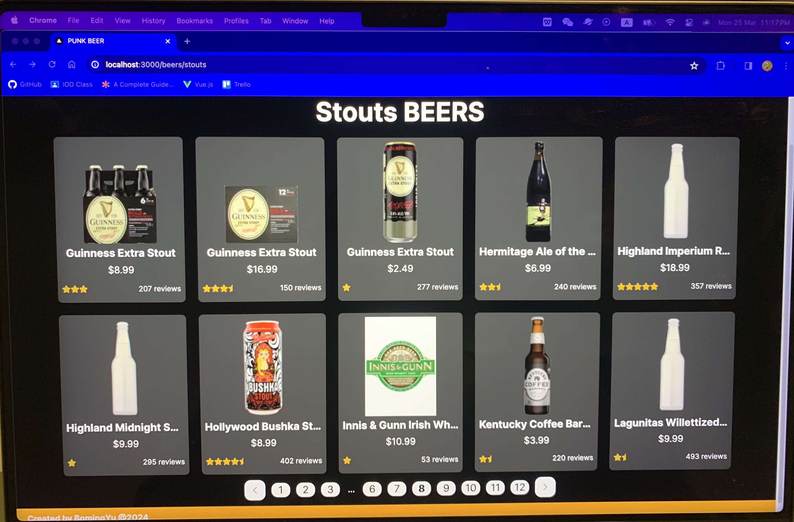

   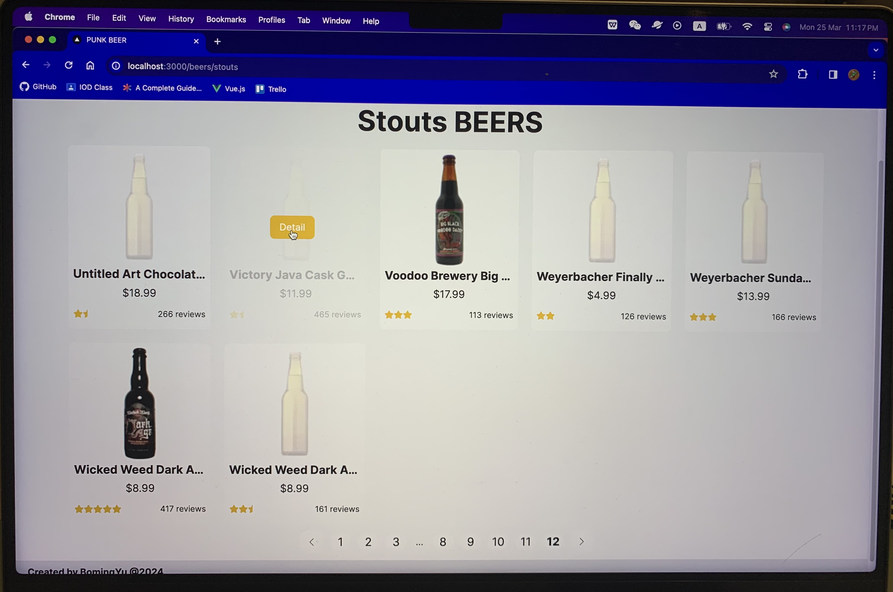

   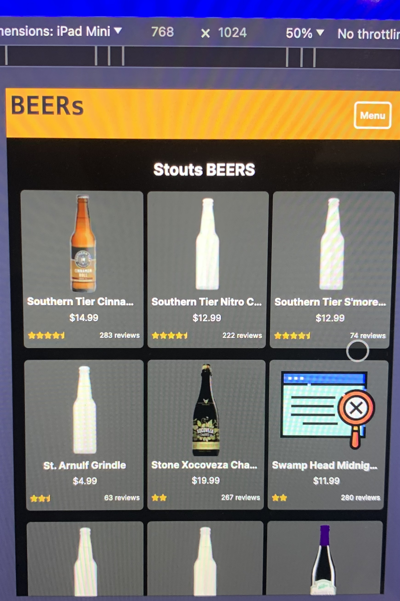

   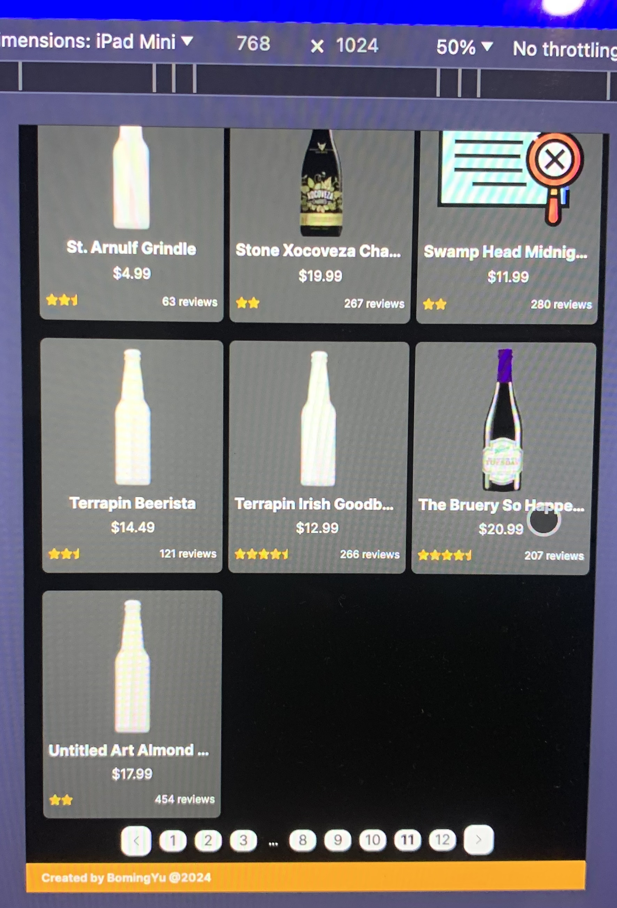

   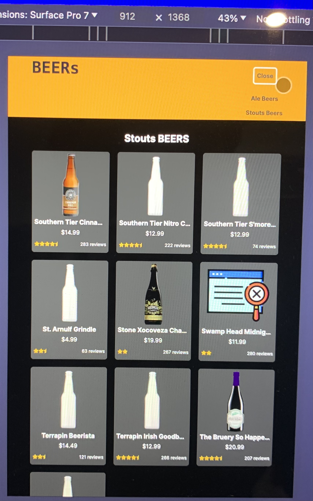

